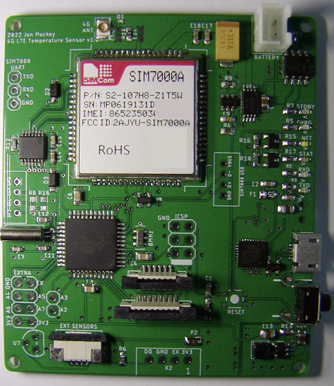

# LTE 4G Sensor

This project  is used to monitor multiple temperature sensors and report out of range conditions to your cell phone via SMS.

A more detailed description of the project will be part of a soon to be published Instructable.

The code is driving a SIM7000 CAT-M1 Multi-Band LTE module asynchronously.  Most of the SIMxxxx classes I've seen block when communicating with the module causing the UI to lockup until the code returns.  In addition, this code is designed to send and receive SMS texts using PDU rather than text mode.  Using PDU mode allows access to the sender's MDN and the SMSC used.

# Classes
LTESensor is a subclass of SIM7000 which is a subclass of TPDU. LTESensor manages the UI and any non generic communication with the SIM7000 via the SIM7000 class. The TPDU class deals with unpacking and packing TPDU Fields of incoming and outgoing SMS messages.

DS18B20Multidrop handles all communication with and monitoring of DS18B20 temperature sensors. DS18B20Multidrop owns an instance of the OneWire class that performs the actual communication with the DS18B20 on the 1-wire bus.

This project uses the OneWire library available [here](https://github.com/PaulStoffregen/OneWire).

# Sensor Board

